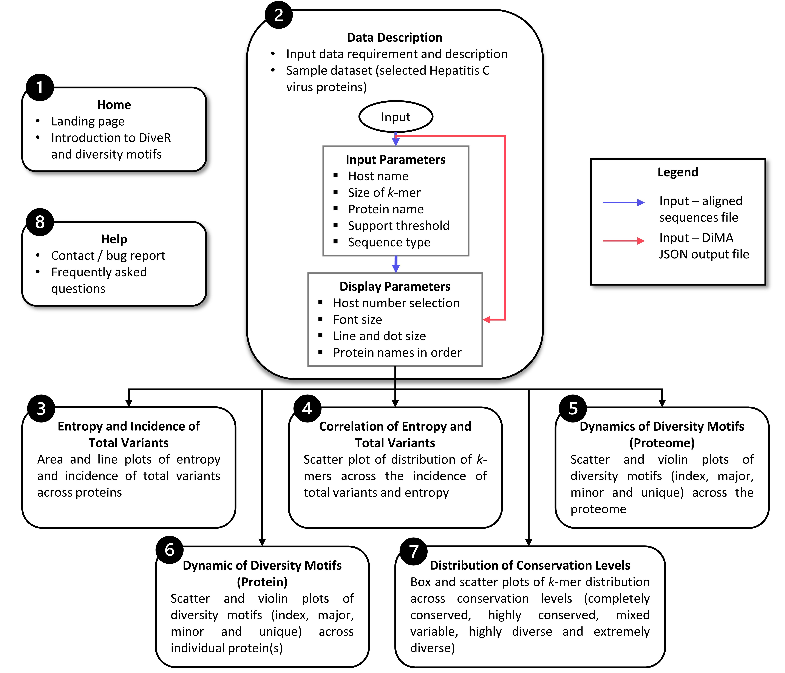

About
===========

Viruses are one of the main contributors to the global burden of infectious-related mortality and disability. Sequence diversity, as a result of various evolutionary forces, can expand host repertoire or enhance infective ability of viruses, resulting in immune escape. This poses a challenge to the design of diagnostic, prophylactic, and therapeutic interventions against viruses. Thus, it is crucial to understand the diversity and the dynamics of viral sequence change to aid in the design of vaccines or development of therapeutics and diagnostics against a virus. The publicly available tool, Diversity Motif Analyser (DiMA; `https://github.com/PU-SDS/DiMA <https://github.com/PU-SDS/DiMA>`_) was developed to facilitate the dissection of sequence diversity dynamics for viruses. DiMA quantifies the sequence diversity using Shannon's entropy for each aligned overlapping *k*-mer positions, distributes the *k*-mers into four diversity motifs (index, major, minor and unique) and stores this information in JSON format. However, interpretation and analysis of data stored in JSON data might be a challenging task to biologists who have limited or no knowledge of bio-informatics or programming background.

Herein, we present vDiveR, a DiMA wrapper implemented as a web-based application, hosted on R Shiny server (`https://protocol-viral-diversity.shinyapps.io/DiveR/ <https://protocol-viral-diversity.shinyapps.io/DiveR/>`_), to ease the visualization of outputs from DiMA. vDiveR allows visualization of the diversity motifs (index, major, minor and unique) for elucidation of the underlying inherent dynamics. The sequence with the highest incidence at a given *k*-mer position in a protein alignment is the index, while all the others at the position are variants to the index. Major variant is the predominant sequence amongst the variants, while minor variants are distinct sequences with frequency lesser than the major variant, but occur more than once. Unique variants are distinct sequences that occur only once. vDiveR presents a total of eight tabs: 1) homepage, 2) data description, with tabs 3) to 7) presenting five plots depicting sequence variability dynamics and lastly 8) help page tab. vDiveR generates five plots for *k*-mer positions of a viral protein/proteome: 

#. entropy and incidence of total variants,
#. relationship between entropy and total variants, 
#. dynamics of diversity motifs for the collective proteome,
#. dynamics of diversity motifs for the individual proteins, and
#. distribution of conservation levels (completely conserved, highly conserved, mixed variable, highly diverse, and extremely diverse). 

In summary, the simplicity of vDiveR makes the study of viral protein sequence diversity dynamics more accessible to a wider community of researchers. This should help better understand the dynamics of sequence change among viruses and further explore its effects on intervention strategies.

Figure 2: Flowchart of vDiveR.

