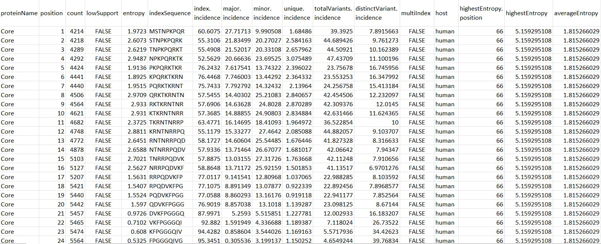

Bioconductor Package
=====================

Input
-------------

vDiveR Bioconductor package functions require a DiMA(v4.1.1) JSON-converted CSV dataframe as input. As DiMA stores its output in JSON format, vDiveR has also provided a JSON2CSV() function to assist users in converting DiMA output from JSON to CSV format. Each DiMA JSON output file is treated as one viral protein. If there is more than one protein to be visualized simultaneously, users are required to concatenate the CSV dataframes (Figure. 8) into one, which will eventually act as the source for subsequent data visualisation and *k*-mer concatenation.

Figure 8. DiMA JSON-converted CSV dataframe format.

#. **proteinName**: name of the protein.
#. **position**: starting position of the aligned, overlapping *k*-mer window.
#. **count**: number of *k*-mer sequences at the given position.
#. **lowSupport**: *k*-mer position with sequences lesser than the minimum support threshold (TRUE) are considered of low support, in terms of sample size.
#. **entropy**: level of variability at the *k*-mer position, with zero representing completely conserved.
#. **indexSequence**: the predominant sequence (index motif) at the given *k*-mer position.
#. **index.incidence**: the fraction (in percentage) of the index sequences at the *k*-mer position.
#. **major.incidence**: the fraction (in percentage) of the major sequence (the predominant variant to the index) at the *k*-mer position.
#. **minor.incidence**: the fraction (in percentage) of minor sequences (of frequency lesser than the major variant, but not singletons) at the *k*-mer position.
#. **unique.incidence**: the fraction (in percentage) of unique sequences (singletons, observed only once) at the *k*-mer position.
#. **totalVariants.incidence**: the fraction (in percentage) of sequences at the *k*-mer position that are variants to the index (includes: major, minor and unique variants).
#. **distinctVariant.incidence**: incidence of the distinct *k*-mer peptides at the *k*-mer position.
#. **multiIndex**: presence of more than one index sequence of equal incidence.
#. **host**: species name of the organism host to the virus.
#. **highestEntropy.position**: *k*-mer position that has the highest entropy value.
#. **highestEntropy**: highest entropy values observed in the studied protein.
#. **averageEntropy**: average entropy values across all the *k*-mer positions.

Sample Dataset
^^^^^^^^^^^^^^^^^^

To demonstrate the functionality of vDiveR, three sample datasets (JSONsample, proteins_1host, protein_2hosts) are provided where: 

1. **JSONsample**: a DiMA JSON output file which acts as the input for JSON2CSV(),
2. **proteins_1host** (consists of protein A and B from human host) and **protein_2hosts** (consists of protein A from human and bat hosts): input for remaining functions.

Sample Output
^^^^^^^^^^^^^^^^^^

.. note::
    Please refer 'section 4. R Shiny App (Output)' for sample output.