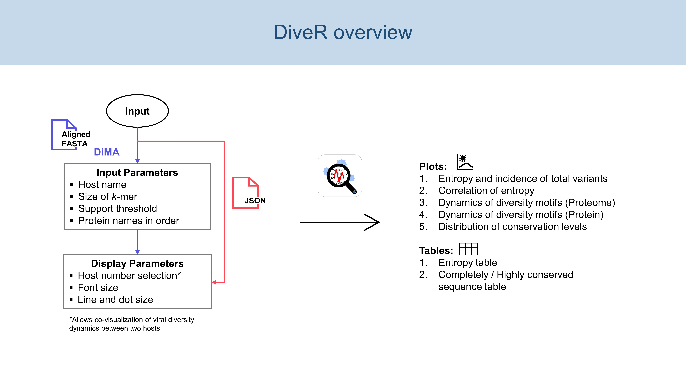

Welcome to vDiveR User Manual!
===================================

.. note::

   This project is under active development. 

vDiveR is a DiMA wrapper implemented web-based application, hosted on R Shiny server (`https://protocol-viral-diversity.shinyapps.io/DiveR <https://protocol-viral-diversity.shinyapps.io//DiveR>`_), to ease the visualization of outputs from Diversity Motif Analyser (DiMA; `https://github.com/PU-SDS/DiMA <https://github.com/PU-SDS/DiMA>`_). vDiveR allows visualization of the diversity motifs (index, major, minor and unique) for elucidation of the underlying inherent dynamics (Figure. 1). 

Additionally, the R source code is publicly accessible from the GitHub repository at `https://github.com/pendy05/DiveR <https://github.com/pendy05/DiveR>`_ (distributed under the MIT license).

Figure 1: vDiveR overview.

.. Hint::

   A demonstration video on how to use vDiveR R Shiny App is available `here <https://youtu.be/rJlmL6Rbp6k>`_!  
   
Contents
----------

.. toctree::
   :maxdepth: 4
   :glob:
   :numbered:

   about
   terminology
   vdiver_usage
   rshiny_app
   bioconductor
   faqs

.. include:: support.rst