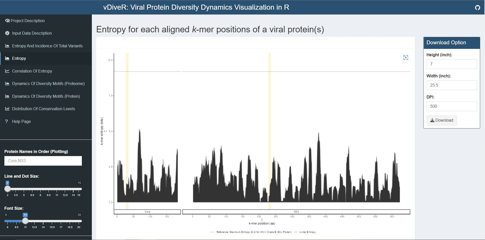

R Shiny App
============

Input File
-------------

vDiveR requires either aligned sequence file(s) or DiMA output file(s) (JSON format) as input file(s), where DiveR will convert and concatenate them (the inputs) into a single CSV file (Figure. 5), which will act as the source for subsequent data visualisation. Each aligned sequence / DiMA output file is treated as one viral protein. Currently, vDiveR accepts aligned FASTA or JSON files generated using multiple sequence alignment (MSA) tools and DiMA, respectively.

.. figure:: images/inputFile_format.JPG
Figure 5. Input CSV file format.

#. **proteinName**: name of the protein.
#. **position**: starting position of the aligned, overlapping *k*-mer window.
#. **count**: number of *k*-mer sequences at the given position.
#. **lowSupport**: *k*-mer position with sequences lesser than the minimum support threshold (TRUE) are considered of low support, in terms of sample size.
#. **entropy**: level of variability at the *k*-mer position, with zero representing completely conserved.
#. **indexSequence**: the predominant sequence (index motif) at the given *k*-mer position.
#. **index.incidence**: the fraction (in percentage) of the index sequences at the *k*-mer position.
#. **major.incidence**: the fraction (in percentage) of the major sequence (the predominant variant to the index) at the *k*-mer position.
#. **minor.incidence**: the fraction (in percentage) of minor sequences (of frequency lesser than the major variant, but not singletons) at the *k*-mer position.
#. **unique.incidence**: the fraction (in percentage) of unique sequences (singletons, observed only once) at the *k*-mer position.
#. **totalVariants.incidence**: the fraction (in percentage) of sequences at the *k*-mer position that are variants to the index (includes: major, minor and unique variants).
#. **distinctVariant.incidence**: incidence of the distinct *k*-mer peptides at the *k*-mer position.
#. **multiIndex**: presence of more than one index sequence of equal incidence.
#. **host**: species name of the organism host to the virus.
#. **highestEntropy.position**: *k*-mer position that has the highest entropy value.
#. **highestEntropy**: highest entropy values observed in the studied protein.
#. **averageEntropy**: average entropy values across all the *k*-mer positions.

Sample Results
-----------------

Figure 6: An example of vDiveR output, comprising of five plots for sample HCV proteins (Core and NS3). (i) Entropy and incidence of total variants for each aligned nonamer (*k*-mer) position of sample proteins. Entropy (black) and incidence of total variants (pink) were measured for each aligned nonamer (nine amino acids; 9-mer) position (1-9, 2-10, etc.) of the sample proteins. The entropy values indicate the level of variability at the corresponding nonamer positions, with zero representing completely conserved positions (total variants incidence of 0%). (ii)  Relationship between incidence of total variants and entropy for HCV proteome nonamer positions (both Core and NS3 collectively). A positive correlation was observed. The nonamer entropy increased as the total variants' incidence increased. No completely conserved (entropy and total variant incidence of zero) nonamer position was observed. (iii) and (iv) Peptides at each of the 9-mer positions were classified into four different motifs, namely index, major, minor and unique, based on their incidences. Nonatypes is defined as the fraction of distinct sequences among the variants at a given position. The diversity spectrum of the *k*-mer position was depicted by the decline of the index incidences (black) and the increase of total variants incidences (pink). (v) Conservation levels of HCV nonamer positions for each individual protein and across the proteome. Both Core and NS3 proteins exhibited highly conserved (90% ≤ index incidence < 100%; blue) and mixed variable (20% ≤ index incidence < 90%; green) nonamer positions, while NS3 also included the highly diverse positions (10% ≤ index incidence < 20%; purple). No completely conserved (index incidence = 100%; black) and extremely diverse (index incidence < 10%; pink) nonamer positions were observed, indicating that the two proteins are of mixed variability.

Test Data
^^^^^^^^^^^^^^^^^^

To demonstrate the functionality of vDiveR, the Core and NS3 proteins of Hepatitis C virus (HCV) were selected and used as sample datasets (Figure. 6). The human host HCV viral protein sequences were retrieved from the publicly available database, National Center for Biotechnology Information (NCBI) Virus (Hatcher et al., 2017). Subsequently, the data was deduplicated using Cluster Database at High Identity with Tolerance (CD-HIT) (Li & Godzik, 2006) and aligned using Multiple Alignment using Fast Fourier Transform (MAFFT) (Katoh et al., 2002). The HCV sample datasets are provided for users to download and run the visualization of sequence change dynamics in vDiveR.

.. Hint::
    Sample result is accessible on vDiveR R Shiny App via the **"Load Sample Dataset"** and **"Download Sample Dataset"** buttons on its side panel.

Output Summary
-------------------

In vDiveR R Shiny App, after providing either aligned sequence file(s) or DiMA JSON output file(s) in tab 2, visualization of dynamics in sequence change in the form of plots will be presented in tabs 3 to 7, with a brief description of the implemented functionalities (Figure 1).

* Tab 3: Entropy and Incidence of Total Variants
* Tab 4: Correlation of Entropy and Total Variants
* Tab 5: Dynamics of Diversity Motifs (Proteome)
* Tab 6: Dynamics of Diversity Motifs (Proteins)
* Tab 7: Distribution of Conservation Levels

.. note::
    If there is only one protein input, no plot is shown in Tab 5.

Output (Plots and Tables)
^^^^^^^^^^^^^^^^^^^^^^^^^^^^

1. Entropy and Incidence of Total Variants

Figure 7.1. Entropy and incidence of total variants plot for sample HCV proteins (Core and NS3).

Entropy (black) and incidence of total variants (pink) were measured for each aligned *k*-mer position (1- *k*, 2- *k* +1, etc.) of the proteins. The entropy values indicate the level of variability at the corresponding *k*-mer positions, with zero representing completely conserved positions (total variants incidence of 0%). Benchmark reference for entropy (black dotted line; 9.2) and total variants (pink dotted line; 98%) from HIV-1 clade B envelope protein (Hu et al., 2013) are provided. For both individual protein and across proteome, the minimum entropy value is zero. The regions highlighted in yellow are *k*-mer positions with zero entropy value.

Figure 7.2. Entropy table for sample HCV proteins (Core and NS3).

A table with minimum and maximum values of entropy and total variants(%) values are provided for each studied protein. Positions that have the minimum entropy values are also provided.

2. Entropy

Figure 7.3. Entropy plot for sample HCV proteins (Core and NS3).

Entropy (black) was measured for each aligned *k*-mer position (1- *k*, 2- *k* +1, etc.) of the proteins. The entropy values indicate the level of variability at the corresponding *k*-mer positions, with zero representing completely conserved positions (total variants incidence of 0%). Benchmark reference for entropy (black dotted line; 9.2) from HIV-1 clade B envelope protein (Hu et al., 2013) is provided. For both individual protein and across proteome, the minimum entropy value is zero. The regions highlighted in yellow are *k*-mer positions with zero entropy value.

3. Correlation of Entropy

Figure 7.4. Correlation of entropy and total variants scatter plot for sample HCV proteins (Core and NS3).

Relationship between incidence of total variants and entropy for viral proteome nonamer positions. At y-axis, the minimum entropy value is zero while the maximum entropy value is obtained by rounding the highest entropy encountered up to integer.

4. Dynamics of Diversity Motifs (Proteome)

Figure 7.5. Dynamics of diversity motifs (proteome) plot for sample HCV proteins (Core and NS3).

*k*-mers are classified into four different motifs, namely index, major, minor and unique, based on their incidences. Distinct variants is defined as distinct sequence for a given *k*-mer position. The above dot plot showcases the relationshop between the distribution of four distinct motifs and mutations. The diversity of the position is depicted by the decline of the index incidences (black), the increase of total variant incidences (pink) and corresponding individual patterns of the major, minor, unique motifs and distinct variants. The below violin plot demonstrates the frequency distribution of the motifs. The width of the plot (x-axis) represents the frequency distribution of a given incidence of the indicated motif. The black thick horizontal line of box plot in the middle represents the median incidence value.

5. Dynamics of Diversity Motifs (Protein(s))

Figure 7.6. Dynamics of diversity motifs (proteins) plot for sample HCV proteins (Core and NS3).

*k*-mers are classified into four different motifs, namely index, major, minor and unique, based on their incidences. Distinct variants is defined as distinct sequence for a given *k*-mer position. The above dot plot showcases the relationshop between the distribution of four distinct motifs and mutations. The diversity of the position is depicted by the decline of the index incidences (black), the increase of total variant incidences (pink) and corresponding individual patterns of the major, minor, unique motifs and distinct variants. The below violin plot demonstrates the frequency distribution of the motifs. The width of the plot (x-axis) represents the frequency distribution of a given incidence of the indicated motif. The black thick horizontal line of box plot in the middle represents the median incidence value.

6. Distribution of Conservation Levels

Figure 7.7. Distribution of conservation levels plot for sample HCV proteins (Core and NS3).

The *k*-mer positions of the proteome and the individual proteins were defined as completely conserved (black) (index incidence = 100%), highly conserved (blue) (90% ≤ index incidence < 100%), mixed variable (green) (20% < index incidence ≤ 90%), highly diverse (purple) (10% < index incidence ≤ 20%) and extremely diverse (pink) (index incidence ≤ 10%).

.. figure:: images/CCS_HCS_table.JPG
    
Figure 7.8. Identification of completely (CCS) / highly conserved (HCS) sequences table for sample HCV proteins (Core and NS3).

The *k*-mer positions that overlapped at least one *k*-mer position or are adjacent to each other are concatenated and displayed in table format. The concatenated sequences can be used for further immune relevance analysis via the usage of the Immune Epitope Database and Analysis Resource (IEDB) (Vita et al., 2019).