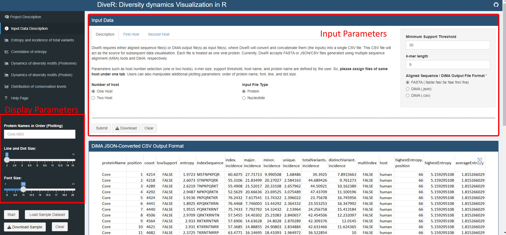

vDiveR Usage
==============

R Shiny App
---------------------

.. Hint::
    You may watch the demonstration video on how to utilize vDiveR R Shiny App `here <https://youtu.be/rJlmL6Rbp6k>`_!

Upload your aligned FASTA / DiMA (v4.1.1) JSON / JSON-converted CSV output file(s) at the *Input Data Description* tab of `vDiveR <https://protocol-viral-diversity.shinyapps.io/DiveR/>`_. There are **five input parameters** (Figure. 4):

- **Host Name**: Species name of the organism host to the studied virus.
- **Size of k-mer**: *k*-mer, a window with size of *k*, gives us the overview, overall diversity of that particular window. By default, DiMA uses *k*-mer size of nine to evaluate the viral diversity, with respect to cellular immune response.
- **Protein Name(s)**: Name of the protein.
- **Support Threshold**: Support is defined as the number of sequences at a given *k*-mer position that are free of gaps, unknown or ambiguous nucleotide bases, and amino acid residues. Positions with less than 30 sequences (default) are defined as of low support.
- **Sequence Type**: Nucleotide or amino acid (default) sequence.

Other than that, vDiveR allows user to manipulate **display parameters** (Figure. 4), such as:

- **Host Number Selection**: Select the number of host studied (one (default) or two hosts). vDiveR supports co-visualization of viral diversity dynamics between two hosts.
- **Font Size**: Font size displayed on the plots.
- **Line and Dot Size**: Line and dot size displayed on the plots.
- **Protein Names in Order**: Determine the order of proteins displayed on plot (Please ensure the protein names provided are the same as the one used in input run!).

Figure 4. Location of the input and display parameters at vDiveR R Shiny App.

Bioconductor Package
---------------------
There are seven functions provided:

#. **json2csv()**: convert DiMA (v4.1.1) JSON output to JSON-converted CSV dataframe, which will act as the data source for other functions in vDiveR.
#. **plot_incidence()**: plot entropy and total variant incidence.
#. **plot_entropy()**: plot entropy.
#. **plot_correlation()**: plot correlation between entropy and total variant incidence.
#. **plot_dynamics_proteome()**: plot dynamics of diversity motifs at proteome level (not recommended if the studied proteins do not represent the entire proteome).
#. **plot_dynamics_protein()**: plot dynamics of diversity motifs at protein level.
#. **plot_conservationLevel()**: plot conservation levels distribution of *k*-mer positions, which consists of 
    - completely conserved (black) (index incidence = 100%), 
    - highly conserved (blue) (90% ≤ index incidence < 100%), 
    - mixed variable (green) (20% < index incidence ≤ 90%), 
    - highly diverse (purple) (10% < index incidence ≤ 20%), and 
    - extremely diverse (pink) (index incidence ≤ 10%).
#. **concat_conserved_kmer()**: concatenate completely/highly conserved k-mer positions that overlapped at least one *k*-mer position or are adjacent to each other and generate the output in dataframe that suits either CSV or FASTA format.

Usage
^^^^^^^^^^^^^^^^^^
**1.json2csv()**

.. code-block:: 

    #default arguments
    json2csv(json_data, hostName = "unknown host", proteinName = "unknown protein")
    #example
    inputdf<-json2csv(JSONsample)

Arguments:

- json_data: DiMA JSON output dataframe
- hostName: name of the host species
- proteinName: name of the protein

**2.plot_incidence()**

.. code-block::

    #default arguments
    plot_incidence(df,host = 1,proteinOrder = "",kmer_size = 9,ymax = 10,line_dot_size = 2,wordsize = 8)
    
    #example 1 (1 host)
    plot_incidence(proteins_1host)
    #example 2 (2 hosts)
    plot_incidence(protein_2hosts, host = 2)

Arguments:

- df: DiMA JSON converted csv file data
- host: number of host (1/2)
- proteinOrder: order of proteins displayed in plot
- kmer_size: size of the *k*-mer window
- ymax: maximum y-axis
- line_dot_size: size of the line and dot in plot
- wordsize: size of the wordings in plot

**2.plot_entropy()**

.. code-block::

    #default arguments
    plot_entropy(df,host = 1,proteinOrder = "",kmer_size = 9,ymax = 10,line_dot_size = 2,wordsize = 8)
    
    #example 1 (1 host)
    plot_entropy(proteins_1host)
    #example 2 (2 hosts)
    plot_entropy(protein_2hosts, host = 2)

Arguments:

- df: DiMA JSON converted csv file data
- host: number of host (1/2)
- proteinOrder: order of proteins displayed in plot
- kmer_size: size of the *k*-mer window
- ymax: maximum y-axis
- line_dot_size: size of the line and dot in plot
- wordsize: size of the wordings in plot

**3.plot_correlation()**

.. code-block::

    #default arguments
    plot_correlation(df,host = 1,alpha = 1/3,size = 3,ylabel = "k-mer entropy (bits)\n",xlabel = "\nTotal variants (%)",ymax = ceiling(max(df$entropy)),ybreak = 0.5)
    
    #example 1 (1 host)
    plot_correlation(proteins_1host)
    #example 2 (2 hosts)
    plot_correlation(protein_2hosts, size = 2, ybreak=1, ymax=10, host = 2)

Arguments:

- df: DiMA JSON converted csv file data
- host: number of host (1/2)
- alpha: any number from 0 (transparent) to 1 (opaque)
- size: dot size in scatter plot
- ylabel: y-axis label
- xlabel: x-axis label
- ymax: maximum y-axis
- ybreak: y-axis breaks

**4.plot_dynamics_proteome()**

.. code-block::

    #default arguments
    plot_dynamics_proteome(df,host = 1,dot_size = 2,word_size = 15,alpha = 1/3)

    #example 1 (1 host)
    plot_dynamics_proteome(proteins_1host)
    #example 2 (2 hosts)
    plot_dynamics_proteome(protein_2hosts, host = 2)

Arguments:

- df: DiMA JSON converted csv file data
- host: number of host (1/2)
- dot_size: dot size in scatter plot
- word_size: word size in plot
- alpha: any number from 0 (transparent) to 1 (opaque)

**5.plot_dynamics_protein()**

.. code-block::

    #default arguments
    plot_dynamics_protein(df,host = 1,proteinOrder = "",base_size = 8,alpha = 1/3,dot_size = 3)

    #example 1 (1 host)
    plot_dynamics_protein(proteins_1host)
    #example 2 (2 hosts)
    plot_dynamics_protein(protein_2hosts, host = 2)

Arguments:

- df: DiMA JSON converted csv file data
- host: number of host (1/2)
- proteinOrder: order of proteins displayed in plot
- base_size: base font size in plot
- alpha: any number from 0 (transparent) to 1 (opaque)
- dot_size: dot size in scatter plot

**6.plot_conservationLevel()**

.. code-block::

    #default arguments
    plot_conservationLevel(df,proteinOrder = "",conservationLabel = 1,host = 1,base_size = 11,label_size = 2.6,alpha = 0.6)

    #example 1 (1 host)
    plot_conservationLevel(proteins_1host, conservationLabel = 1,alpha=0.8, base_size = 15)
    #example 2 (2 hosts)
    plot_conservationLevel(protein_2hosts, conservationLabel = 0, host=2)

Arguments:

- df: DiMA JSON converted csv file data
- proteinOrder: order of proteins displayed in plot
- conservationLabel: 0 (partial; show present conservation labels only) or 1 (full; show ALL conservation labels) in plot
- host: number of host (1/2)
- base_size: base font size in plot
- label_size: conservation labels font size
- alpha: any number from 0 (transparent) to 1 (opaque) 

**7.concat_conserved_kmer()**

.. code-block::

    #default arguments
    concat_conserved_kmer(data,conservationLevel = "HCS",kmer = 9,output_type = "csv")

    #example 1 (1 host and store the output in csv format)
    csv<-concat_conserved_kmer(proteins_1host)
    #example 1 (1 host and store the HCS output in FASTA format)
    fasta <- concat_conserved_kmer(protein_2hosts, output_type = "fasta", conservationLevel = "HCS")
    #example 2 (2 hosts)
    csv_2hosts<-concat_conserved_kmer(protein_2hosts, conservationLevel = "CCS")

Arguments:

- data: DiMA JSON converted csv file data
- conservationLevel: CCS (completely conserved) / HCS (highly conserved)
- kmer: size of the *k*-mer window
- output_type: type of the output; "csv" or "fasta"

